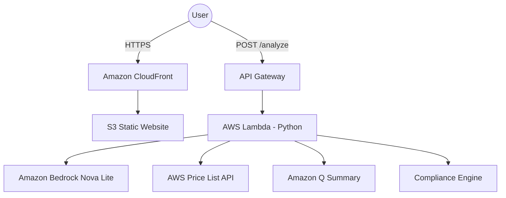

# KAGUIDE AI
### AWS Architecture Advisor: Describe. Architect. Cost. Comply.

**KAGuide AI** is a high-performance, fully stateless web application designed to bridge the gap between plain-language intent and professional AWS architecture. Input a simple description of your app, and receive an optimized service map, real-time cost projections, compliance analysis, and deployment-ready IAM policies—instantly.

## ✨ Features

* **Natural Language Architecting** – Powered by **Amazon Bedrock (Nova Lite)** to translate plain English into tailored AWS stack recommendations.
* **Real-time Cost Dashboard** – Interactive traffic sliders (10 to 1M MAU) with instant client-side recalculations.
* **Viral Spike Simulator** – Model sudden traffic surges (10x to 100x) to visualize architectural elasticity and cost impact.
* **Free Tier Awareness** – Visual indicators (Green/Amber/Red) identifying services that remain within the AWS Free Tier.
* **Automated Compliance Engine** – Heuristic analysis for **GDPR, CCPA, and LGPD** with regional latency and residency recommendations.
* **Security First** – Instant generation of **Least-Privilege IAM Policies** (JSON) ready for deployment.
* **Amazon Q Insights** – Plain-language trade-off summaries to explain complex architectural decisions.
* **Zero-Footprint Privacy** – No databases, no cookies, and no persistence. All state is ephemeral and cleared on tab close.

## 🛠 Tech Stack

| Layer | Technology |
| :--- | :--- |
| **Frontend** | React 18 + Vite + TypeScript, Recharts, CSS Modules |
| **Backend** | Python 3.12 (AWS Lambda), Boto3 |
| **AI/ML** | Amazon Bedrock (Nova Lite), Amazon Q |
| **Cloud Infra** | API Gateway (REST), S3 + CloudFront (Static Hosting) |
| **Provisioning** | AWS SAM (Serverless Application Model) |
| **Testing** | Vitest + fast-check (FE), pytest + hypothesis (BE) |

---

## 📂 Project Structure

```text
kaguide-ai/
├── frontend/                  # React/Vite/TS (High-Energy UI)
│   ├── src/
│   │   ├── pages/             # Results, Compliance, IAM Export
│   │   ├── components/        # TrafficSlider, ViralSpikeSimulator, CostCharts
│   │   ├── context/           # In-memory global state (No persistence)
│   │   └── utils/             # api.ts, costCalc.ts
│   └── deploy-notes.md        # S3 + CloudFront deployment guide
├── backend/                   # Python Lambda Microservices
│   ├── lambda_handler.py      # Entry point — Pipeline orchestration
│   ├── bedrock_pipeline.py    # Intent parsing & service mapping
│   ├── pricing.py             # AWS Price List API integration
│   ├── compliance_engine.py   # GDPR/CCPA/LGPD logic
│   ├── iam_generator.py       # Least-privilege JSON generation
│   └── template.yaml          # AWS SAM Infrastructure as Code
└── .kiro/specs/               # Requirement & Design specs
```

## 🚀 Quick Start

### Prerequisites
* Node.js ≥ 18
* Python 3.12
* AWS CLI configured (`aws configure`)
* SAM CLI ≥ 1.100

### 1. Backend Deployment
```bash
cd backend
sam build
sam deploy --guided
```
*Note the `ApiUrl` output provided by SAM.*

### 2. Frontend Setup
Create `frontend/.env`:
```text
VITE_API_URL=https://<your-api-id>.execute-api.<region>.amazonaws.com/prod/analyze
```
```bash
cd frontend
npm install
npm run dev
```
### 3. Production Build
```bash
npm run build
aws s3 sync dist/ s3://<your-bucket-name> --delete
```

## 🏗 Architecture Overview



## 🔒 Privacy & Security
* **Stateless by Design:** Lambda never writes user input to logs or storage.
* **Encryption:** API Gateway request/response logging is disabled to protect architectural IP.
* **Ephemeral State:** The frontend utilizes zero `localStorage` or `sessionStorage`. Your data exists only in-memory and vanishes on refresh.


## 💰 AWS Free Tier Compliance
The entire KAGuide AI stack is architected to run within **AWS Free Tier** limits:
* **Lambda:** 1M requests/month (Always Free).
* **CloudFront:** 1 TB data transfer (Always Free).
* **Bedrock/Amazon Q:** Standard Free Tier invocation allowances.

## 🧪 Testing
```bash
# Run Frontend Unit & Property Tests
cd frontend && npm test

# Run Backend Logic Tests
cd backend && pytest
```

## 📄 License
MIT © 2026 KAGuide AI
